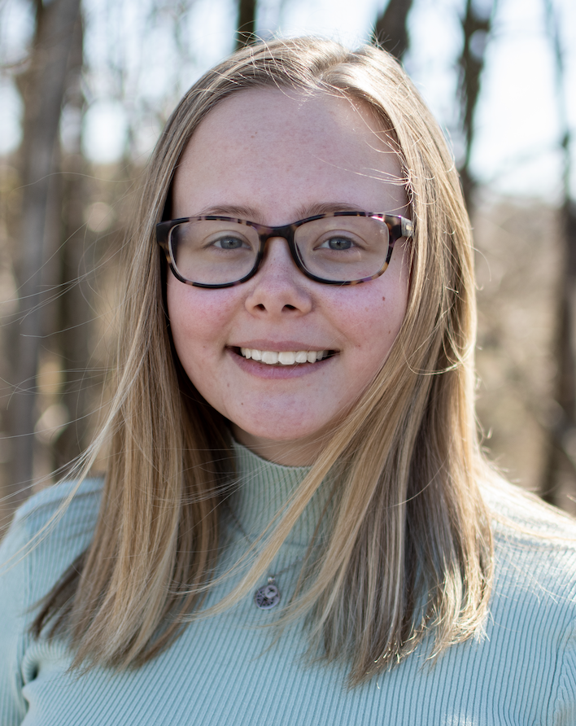

# Resume

<!DOCTYPE html>
	<head>

		<title>Charlotte's Resume</title>
	</head>

	<body>
		<h1>Charlotte Matherly — Journalist</h1>

		

		
Contact 
			Education 
			Experience 
			Skills & Abilities 
		Awards & Extracurriculars

		<h2>Contact</h2>
		
<strong>Address:</strong> 
			454 Teaberry Lane 
			Harrisonburg, VA 22801

		
<strong>Phone:</strong> 864.915.3463 
			<strong>Email:</strong> matherlycgm@gmail.com

		<h2>Education</h2>
		<h3>James Madison University</h3>
			<ul>
				<li>BA in media arts and design</li>
				<li>Concentration in Journalism</li>
				<li>Graduating in Spring 2023</li>
			</ul>
		<h3>Piedmont Virginia Community College</h3>
			<ul>
				<li>Partial degree</li>
				<li>2018-2019</li>
			</ul>
		<h3>Greenville Technical College</h3>
			<ul>
				<li>Dual credit courses to finish high school</li>
				<li>Partial Degree</li>
				<li>2017-2018</li>
			</ul>

		<h2>Experience</h2>
		<h3>Editor-in-Chief, <a href="https://breezejmu.org" target="_blank"><em>The Breeze</em></a></h3>
			Current position — started April 2022
			<ul>
				<li>Lead a team of ~15 editors in the creation of a weekly newspaper and daily online content.</li>
				<li>Coordinate content across print, online, broadcast, audio and social media.</li>
				<li>Guide The Breeze's coverage of JMU and Harrisonburg news with an emphasis on recruitment, audience outreach and in-depth investigative work.</li>
			</ul>
		<h3>City/Policy Reporter, <a href="https://hburgcitizen.com" target="_blank"><em>The Harrisonburg Citizen</em></a></h3>
			Current position — started May 2022
			<ul>
				<li>Report on biweekly city council meetings, recapping important news elements of city government for the community.</li>
				<li>Report on housing and education in Harrisonburg.</li>
			</ul>
		<h3>Culture Editor, <em>The Breeze</em></h3>
			April 2021 - April 2022
			<ul>
				<li>Worked with editorial staff to design a weekly print newspaper and daily online content.</li>
				<li>Managed a staff of 25 writers and shape the culture section's print, online, audio and social media content.</li>
				<li>Expanded The Breeze's culture coverage, publishing hard-hitting and high-impact stories tackling social issues and complex subjects within the JMU and local communities.</li>
			</ul>
		<h3>Multimedia Journalist, <em>JMU School of Media Arts and Design</em></h3>
			July 2020 - May 2022
			<ul>
				<li>Produced consistent content centered on students, professors, alumni, classes, opportunities and events in JMU's School of Media Arts and Design.</li>
				<li>Meet deadlines and work to revise articles for publication.</li>
			</ul>
		<h3>Election Stringer, <em>The Associated Press</em></h3>
			Nov. 2, 2021 and June 21, 2022
			<ul>
				<li>Accurately and quickly reported live ballot counts from Harrisonburg to the AP for the 2021 Virginia gubernatorial, lieutenant governor, attorney general and 26th delegate races, as well as the 2022 Republican Congressional primary for the 6th district of Virginia.</li>
			</ul>
		<h3>Reporting Intern, <em>The Harrisonburg Citizen</em></h3>
			May 2021 - August 2021
			<ul>
				<li>Provided consistent coverage for a daily online publication, including the city's school board.</li>
				<li>Wrote in-depth profile pieces about local authors and business owners.</li>
			</ul>
		<h3>Staff Writer, <em>The Breeze</em></h3>
			Sept. 2019 - March 2021
			<ul>
				<li>Provided in-depth and well-researched content for the culture, opinion and business sections of The Breeze.</li>
				<li>Covered breaking news events, the COVID-19 pandemic, business trends and social issues as they related to the JMU and Harrisonburg communities.</li>
			</ul>

		<h2>Skills & Abilities</h2>
			<ul>
				<li>Service-oriented leader who fosters a culture of learning in the newsroom.</li>
				<li>Thoughtful decision-maker with a strong moral and ethical compass.</li>
				<li>Well-versed in media law and ethics.</li>
				<li>Brings attention to detail while keeping the big picture in mind.</li>
				<li>Proficient in editing articles with a sharp eye for clean copy.</li>
				<li>Proficient in page and web design principles.</li>
				<li>Experience in many areas of reporting, including breaking news, protests, features, profiles, investigations, housing, education, mental health and social issues.</li>
			</ul>

		<h2>Awards & Extracurriculars</h2>
			<ul>
				<li>1st place Virginia Press Association award for profile writing</li>
				<li>Recipient of the 2021 Byrd-Mims Journalism Scholarship</li>
				<li>President's List: Fall 2017, Spring 2018</li>
				<li>Dean's List: Spring 2020, Fall 2020, Spring 2021</li>
				<li>Member of JMU's chapter of the National Society of Leadership and Success, inducted in Spring 2020.</li>
			</ul>

	</body>
</html>
